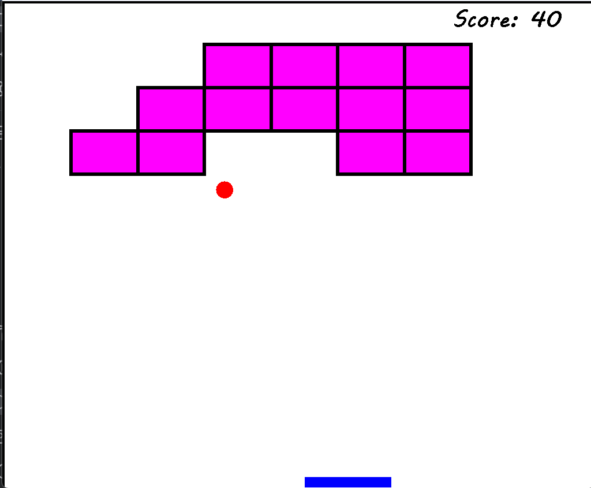

# Brick-Breaker

Brick Breaker is a 2D arcade-style game developed in Java using Swing and AWT libraries. It features a paddle controlled by the player to bounce a ball and break bricks arranged in a grid. The game includes real-time mechanics such as collision detection, score tracking, and win/lose conditions. Designed with a modular structure using object-oriented principles and event-driven programming.

